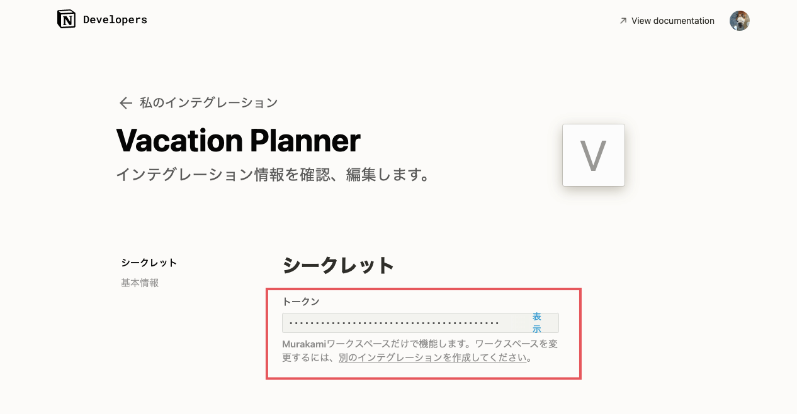
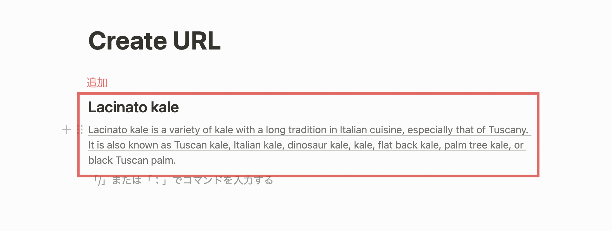
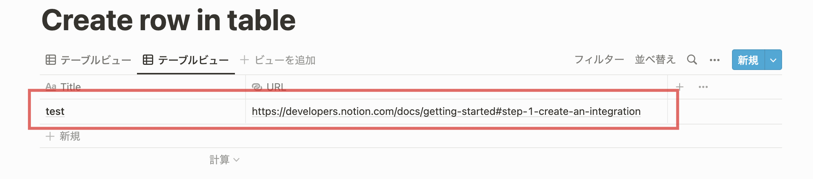
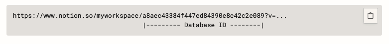

# Notion API 検証
## 【事前準備】インテグレーションを作成/トークン取得

下記リンク先の手順に従って統合を作成し、APIを叩く際に必要なトークンを取得する

[Step 1: Create an integration.](https://developers.notion.com/docs/getting-started#step-1-create-an-integration)



## ページ内にリンクを貼り付ける
`PATCH https://api.notion.com/v1/blocks/{block_id}/children`

- `block_id`の取得
  - ブロックID = ページID(ページもブロックの一種)
    - [共有 > リンクをコピー > リンクの一部をページIDとして取得]
    - ページのURLが「`https://www.notion.so/sample-bb2c7336fe2941f6a47666ee41484ac1`」であれば、「`bb2c7336fe2941f6a47666ee41484ac1`」がページIDとなる
  - 参考
    - [Reading blocks from a page](https://developers.notion.com/docs/working-with-page-content#reading-blocks-from-a-page)
    - [How to get the block Id in Notion API?](https://stackoverflow.com/questions/67618449/how-to-get-the-block-id-in-notion-api)

下記画像のように指定されたページにブロックを追加する。


参考
- [Appending blocks to a page](https://developers.notion.com/docs/working-with-page-content#appending-blocks-to-a-page)
- [Append block children](https://developers.notion.com/reference/patch-block-children)


### Header
TOKENは事前準備の際に取得したものを使用する。

| key            | value            |
| -------------- | ---------------- |
| Content-Type   | application/json |
| Authorization  | Bearer $TOKEN     |
| Notion-Version | 2022-02-22       |

### JSON
```json
{
	"children": [
		{
			"object": "block",
			"type": "heading_2",
			"heading_2": {
				"rich_text": [{ "type": "text", "text": { "content": "Lacinato kale" } }]
			}
		},
		{
			"object": "block",
			"type": "paragraph",
			"paragraph": {
				"rich_text": [
					{
						"type": "text",
						"text": {
							"content": "Lacinato kale is a variety of kale with a long tradition in Italian cuisine, especially that of Tuscany. It is also known as Tuscan kale, Italian kale, dinosaur kale, kale, flat back kale, palm tree kale, or black Tuscan palm.",
							"link": { "url": "https://en.wikipedia.org/wiki/Lacinato_kale" }
						}
					}
				]
			}
		}
	]
}
```

## データベース内にリンクを貼り付ける
`POST https://api.notion.com/v1/pages`

フルページのデータベースに対して、下記に貼り付けた画像のように「Title」「URL」をプロパティとして持つページを作成する。
データベースのレコードとしてページが追加されていく。


参考
- [Create a page](https://developers.notion.com/reference/post-page)
- [Getting started](https://developers.notion.com/docs)

### Header
TOKENは事前準備の際に取得したものを使用する。

| key            | value            |
| -------------- | ---------------- |
| Content-Type   | application/json |
| Authorization  | Bearer $TOKEN     |
| Notion-Version | 2022-02-22       |

### JSON
- `DATABASE_ID`の取得方法
  - [共有 > リンクをコピー > リンクの一部をdatabase_idとして取得]
  
  - [Adding pages to a database](https://developers.notion.com/docs/working-with-databases#adding-pages-to-a-database)
- json内の「Title」「URL」は、作成しているデータベースのプロパティ名と合わせる必要がある

```json
{
 "parent": { "database_id": "$DATABASE_ID" },
	"properties": {
		"Title": {
			"title": [
				{
					"text": {
						"content": "test"
					}
				}
			]
		},
		"URL": {
			"url": "https://developers.notion.com/docs/getting-started#step-1-create-an-integration"
		}
	}
}
```
